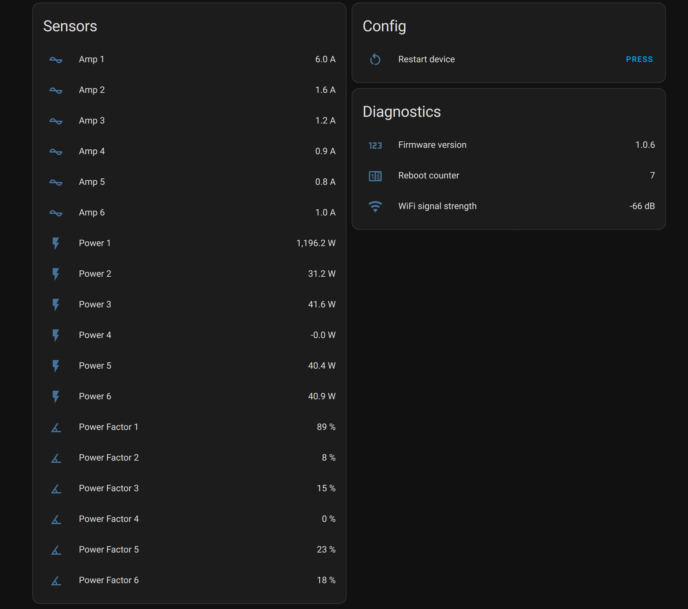

# homeassistant-goecontroller-mqtt

This is a Home Assistant custom component written for the [go-eController](https://go-e.com/en/products/go-e-controller).

If it wouldn't have been for @syssi and his [go-eCharger component](https://github.com/syssi/homeassistant-goecharger-mqtt) this component may never have been created. A huge thanks to him :heart:!

## Installation

Use HACS to install this custom component.

## Configuration

Use the Web UI (Config flow) to add the "go-eController" integration. You have to know the `serial number` (6 digits) of your device. Please don't forget to enable the MQTT API (v2) via the go-e Controller app first.

## References

- https://github.com/goecontroller/go-eController-API-v2/blob/main/apikeys-en.md
